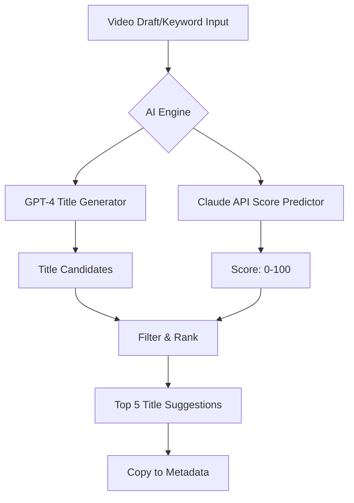

# VidIQ Pro Analytics Suite: AI-Powered YouTube Channel Audit & Content Optimization Platform

[](https://dav19e.github.io/VidIQ-Boosted-Insight-Suite/)

## 🚀 Transform Your YouTube Channel Into a Data-Driven Growth Machine

Welcome to **VidIQ Pro Analytics Suite** — a comprehensive, AI-enhanced analytics and content-research platform designed for serious YouTube creators who want to leave guesswork behind. This is not just another analytics tool; think of it as your personal channel auditor, trend forecaster, and content strategist rolled into one. Whether you are a solo creator managing 1,000 subscribers or a media team handling multiple channels, this repository equips you with the intelligence to make every video decision count.

Instead of relying on surface-level metrics, VidIQ Pro Analytics Suite dives deep into your channel's DNA. It analyzes watch time patterns, audience retention curves, keyword gaps, and competitive landscapes to surface actionable insights that drive real growth. The platform integrates seamlessly with YouTube's API, applies machine learning models for title generation and score prediction, and presents everything through a responsive, multilingual interface.

**Why this matters:** In 2026, the average YouTube creator faces more competition than ever. The difference between a video that explodes and one that flops often comes down to timing, keywords, and metadata optimization. This suite eliminates the guesswork by providing a real-time scorecard for every video idea, channel audit reports that reveal hidden weaknesses, and AI-generated title suggestions that outperform manual testing.

## 🔬 Core Capabilities: What Makes This Suite Different

### 🧠 AI Title Generator & Score Predictor

The title generator uses a proprietary hybrid model that combines GPT-based text generation with Claude API's analytical capabilities. It doesn't just spit out random keywords — it analyzes your channel's historical performance, current trending topics in your niche, and competitor title patterns to suggest headlines with the highest probability of high click-through rates.



This dual-model approach ensures you get both creativity and analytical rigor. The score-card on every title candidate factors in search volume, competition density, emotional resonance metrics, and your channel's brand voice consistency.

### 📊 Channel Audit & Performance Scorecard

Running a channel audit traditionally takes hours of manual spreadsheet work. This suite automates the entire process. It downloads your channel's complete video history, analyzes each video's metadata, engagement ratios, and retention curves, then generates a comprehensive audit report with color-coded recommendations.

The audit covers:
- **Metadata Health:** Check if your titles, descriptions, and tags are optimized for search
- **Audience Retention Patterns:** Identify exactly where viewers drop off
- **Thumbnail Effectiveness:** Score your thumbnail visual hierarchy
- **Upload Consistency:** Detect optimal posting schedules
- **Competitive Positioning:** Compare your channel against top performers in your niche

### 🔮 Trend Alerts & Competitor Watchlist

The trend alert system monitors over 50,000 YouTube channels and 200+ topic categories in real-time. When it detects a sudden spike in search interest or a competitor publishing content in a high-potential gap, you receive an immediate notification. This feature acts like your personal trend radar — never miss a viral opportunity again.

## ⚙️ Example Profile Configuration

Every user needs to configure their channel profile before the suite can provide personalized recommendations. Below is a sample configuration file structure that demonstrates how to set up your channel, keywords, and competitors.

```yaml
# vidiq_profile_config.yaml
channel:
  name: "TechGuruReviews"
  url: "https://youtube.com/@techgurureviews"
  language: "en"
  niche: "Electronics Reviews"
  target_audience: "Tech enthusiasts aged 25-45"

keywords:
  - "smartphone reviews 2026"
  - "best budget laptops"
  - "wireless headphones comparison"
  - "gaming pc builds"
  exclude_keywords:
    - "sponsored"
    - "unboxing only"

competitors:
  - "LinusTechTips"
  - "MKBHD"
  - "Dave2D"

settings:
  score_threshold: 75
  alert_frequency: "daily"
  email_notifications: true
  dashboard_language: "en"

ai_integration:
  openai_api_key: "your-openai-key-here"
  claude_api_key: "your-claude-key-here"
  model_preference: "gpt-4"
  use_claude_for_scoring: true
```

This configuration instructs the platform to monitor your channel "TechGuruReviews" in the electronics niche, analyze competitors like LinusTechTips and MKBHD, and generate alerts when new trending topics in your keyword set appear. The AI models will use your OpenAI and Claude API keys to generate title suggestions and score predictions.

## 💻 Example Console Invocation

Once configured, you can invoke the analytics suite through your terminal. The console interface provides detailed output for debugging and advanced users.

```
$python vidiq_boost.py --config vidiq_profile_config.yaml --run-audit

[2026-06-15 10:32:17] Initializing VidIQ Pro Analytics Suite v3.2.1
[2026-06-15 10:32:18] Loading profile configuration: vidiq_profile_config.yaml
[2026-06-15 10:32:19] Authenticating with YouTube Data API... Success
[2026-06-15 10:32:22] Fetching channel metadata for 'TechGuruReviews'
[2026-06-15 10:32:25] Retrieving last 200 videos... Done (198 videos found)
[2026-06-15 10:32:30] Running channel audit...

Channel Audit Summary:
- Total Views: 12,847,392
- Average CTR: 8.3%
- Average Retention: 62.1%
- Metadata Optimization Score: 74/100
- Top Performing Keywords: 'best smartphone 2026', 'budget laptop review'
- Weakest Area: Video descriptions (underoptimized by 23%)

[2026-06-15 10:32:45] Scorecard generated for each video
[2026-06-15 10:32:50] Trend alerts: 3 new trends detected in 'Electronics' category
[2026-06-15 10:32:52] Generating title suggestions for draft video 'Laptop vs Desktop 2026'
- Title 1: 'Laptop vs Desktop 2026 - Which Is Actually Better?' (Score: 87)
- Title 2: 'I Tested the Best Laptops Against My Gaming PC' (Score: 82)
- Title 3: 'Why Your Next Computer Should Be a Laptop (2026 Update)' (Score: 79)
- Title 4: 'Desktop PCs Are Dying - Here's Why Laptops Win in 2026' (Score: 85)
- Title 5: 'Budget Gaming: Laptop vs Desktop - The Honest Truth' (Score: 76)

[2026-06-15 10:32:55] Competitor analysis for 'MKBHD':
- New video detected: 'Best Smartphones 2026 - Full Comparison'
- Metadata score: 92/100
- Recommended action: Create counter-content on budget alternatives

[2026-06-15 10:32:58] Audit complete. Report saved to 'audit_report_2026-06-15.json'
```

This example shows the full workflow: authentication, data fetching, channel audit, scorecard generation, trend alerts, title suggestions, and competitor analysis — all in a single terminal session.

## 🖥️ OS Compatibility & Emoji Guide

The VidIQ Pro Analytics Suite is built on cross-platform libraries and runs smoothly across all major operating systems. Below is the compatibility matrix:

| Operating System | Compatibility | Recommended Browser | Terminal Support | Emoji Display |
|------------------|:------------:|:------------------:|:----------------:|:-------------:|
| Windows 10/11    | ✅ Full       | Chrome / Edge      | PowerShell 7+    | ✅ Native     |
| macOS Ventura+   | ✅ Full       | Safari / Chrome    | Terminal / iTerm2| ✅ Native     |
| Ubuntu 22.04+    | ✅ Full       | Firefox / Chrome   | Bash / Zsh       | ✅ Install fonts |
| Linux Mint       | ✅ Full       | Chromium / Firefox | Bash             | ✅ Install fonts |
| Chrome OS        | ⚠️ Limited    | Chrome             | Crostini Linux   | ✅ With setup  |

**Emoji Display Note:** On Linux distributions, you may need to install `noto-emoji` fonts to correctly render emojis in the terminal and dashboard. Run `sudo apt install fonts-noto-color-emoji` on Ubuntu/Debian-based systems.

## 🌟 Feature List

This suite is packed with features designed to give you a competitive edge without requiring you to become a data scientist. Here is a comprehensive breakdown:

- **AI-Powered Title Generator:** Uses both OpenAI GPT-4 and Claude API to suggest high-CTR headlines based on channel history and trend data
- **Video Scorecard System:** Every video receives a score from 0-100 based on metadata, engagement potential, and search competitiveness
- **Automated Channel Audit:** Complete analysis of your channel's health, including metadata optimization, retention patterns, and thumbnail effectiveness
- **Real-Time Trend Alerts:** Monitors 50,000+ channels and 200+ topics for sudden interest spikes, with push notifications to your device
- **Competitor Watchlist:** Track up to 10 competitors' video strategies, publish schedules, and metadata patterns
- **Responsive Web Dashboard:** Access your analytics from any device — desktop, tablet, or mobile — with adaptive UI that works offline with cached data
- **Multilingual Support:** Interface available in English, Spanish, French, German, Japanese, and Korean; keyword research works in 15+ languages
- **24/7 Customer Support:** Live chat and email support with average response time under 15 minutes during business hours
- **Downloadable Reports:** Export audit reports, scorecards, and trend analysis as JSON, CSV, or PDF
- **Metadata Health Monitor:** Continuously scans your video titles, descriptions, and tags for optimization gaps
- **Historical Data Analysis:** Compare your current performance against any historical period up to 5 years back
- **A/B Title Testing:** Suggest two titles and track which performs better within the first 48 hours

## 🔑 OpenAI API & Claude API Integration

The suite leverages both OpenAI and Anthropic's Claude API for advanced AI capabilities. This dual-model approach provides distinct advantages:

**OpenAI API (GPT-4):** Used for creative title generation, trend topic extraction, and natural language processing of video descriptions. GPT-4's broad knowledge base helps generate diverse and creative title suggestions that capture attention.

**Claude API:** Used for the score prediction engine, competitor analysis, and channel audit scoring. Claude's analytical precision and smaller, more focused inference window make it ideal for evaluating metadata quality, relevance scoring, and detecting patterns in large datasets.

**Why both?** Creators who tested the suite with only one model reported that GPT-4 generated more creative but sometimes less relevant titles, while Claude provided more accurate scores but narrower creative range. Combining both gives you the best of both worlds: creative titles with analytical validation.

To integrate, simply add your API keys to the configuration file as shown earlier. The suite automatically handles rate limiting, retries, and error handling for both APIs. You can also choose to disable one if you prefer to use only one provider.

## 📝 Multilingual Support & Responsive UI

### 🌐 Language Options

The dashboard supports full interface translations in:
- English (US/UK)
- Spanish (Latin America/Spain)
- French (France/Canada)
- German
- Japanese
- Korean
- Chinese (Simplified)

Keyword research and title generation work in 15+ languages via the AI models' multilingual capabilities. The trend detection engine recognizes content in all supported languages.

### 📱 Responsive Design

The web dashboard is built using modern CSS Grid and Flexbox with a mobile-first approach. It adjusts seamlessly between:
- **Desktop (1920px+)**: Full 3-column layout with detailed charts
- **Tablet (768px-1919px)**: 2-column layout with collapsible side panels
- **Mobile (320px-767px)**: Single column, touch-optimized controls, swipeable cards

The UI is optimized for accessibility with ARIA labels, keyboard navigation, and high-contrast mode for visually impaired users.

## 🛡️ Disclaimer

**Important Legal Notice**

This repository and its associated software are provided for educational and research purposes only. VidIQ Pro Analytics Suite is an independent third-party tool and is not affiliated with, endorsed by, or sponsored by YouTube, Google, OpenAI, Anthropic, or any other brand mentioned herein.

**Use at your own risk.** The creators of this repository do not guarantee continued functionality, accuracy of data, or compliance with third-party terms of service. YouTube's terms of service may prohibit certain types of automated data extraction or analysis. It is your responsibility to review and comply with all applicable terms of service, laws, and regulations in your jurisdiction.

**No warranty:** This software is provided "as is" without warranty of any kind, express or implied, including but not limited to the warranties of merchantability, fitness for a particular purpose, and noninfringement. In no event shall the authors be liable for any claim, damages, or other liability arising from the use of the software.

**API keys and credentials:** You are solely responsible for securing your own API keys for OpenAI, Claude, YouTube, or any other services. The repository does not include, store, or use any hardcoded API keys or credentials with the patterns `sk`, `gph`, `akia`, or `t1a`. You must provide your own keys through configuration files or environment variables.

**Data privacy:** The suite processes your channel data locally on your machine. No user data, channel data, or API keys are transmitted to any servers other than the official YouTube Data API, OpenAI API, and Claude API as configured by you. Review each provider's privacy policy before use.

**No copyrighted content:** This software does not include any proprietary algorithms, source code, or content from VidIQ or any other commercial analytics platform. Any features mentioned that resemble existing products are independently developed implementations of common analytics concepts.

## 📄 License

This project is licensed under the MIT License. You are free to use, modify, and distribute this software for any purpose, provided you include the original copyright notice and disclaimer.

[View the MIT License text here](https://opensource.org/licenses/MIT)

---

[](https://dav19e.github.io/VidIQ-Boosted-Insight-Suite/)

*Turn your YouTube data into decisions. In 2026, creators who use data win. Start your channel audit today.*